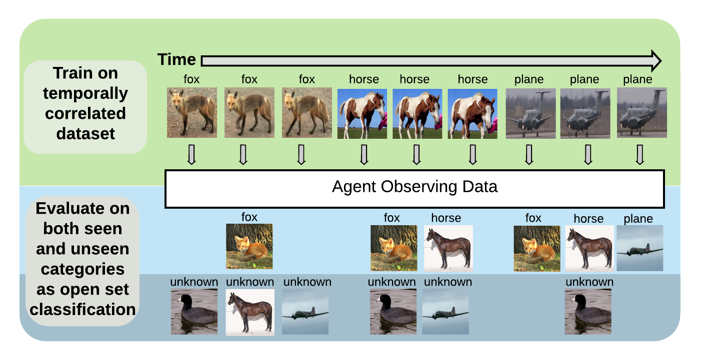

# Stream-51
The Stream-51 dataset for streaming classification and novelty detection from videos. A link to our full paper is included [here](http://openaccess.thecvf.com/content_CVPRW_2020/html/w15/Roady_Stream-51_Streaming_Classification_and_Novelty_Detection_From_Videos_CVPRW_2020_paper.html) and our project webpage can be found [here](https://tyler-hayes.github.io/stream51).

## Training Protocol


The Stream-51 protocol poses unique challenges, requiring agents to learn from temporally correlated datastreams and recognize unlearned concepts as novel. Training data can be ordered either just by instance or by both class and instance. Evaluation data includes a set of novel examples from classes unseen during training.  The baselines established in our paper were from the instance and class instance ordering with random ordering establshed by three seperate seeds.  We have listed the exact training and evaluation orderings for each ordering/seed in the orderings folder.

## Dataset
You can Download the dataset here: [Stream-51](https://drive.google.com/file/d/15huZ756N2cp1CCO4HxF-MVDsMx1LMoIn/view?usp=sharing)

## Dependences 
- Tested with Python 3.6 and PyTorch 1.1.0, or Python 3.7 and PyTorch 1.3.1, NumPy, NVIDIA GPU

## PyTorch Datasets and Dataloaders
For training PyTorch models we have provided a sample dataset class and dataloader function in the `StreamDataset.py` file above. The StreamDataset class allows specifying one of the baseline orderings ('iid', 'class_iid", 'instance', or 'class_instance') for organizing the dataset according to the desired streaming learning paradigm.

## Experiments
We have included python scripts in the experiments folder for training the offline and streaming models used for establishing baseline performance.  Within this folder are bash scripts to set the appropriate variables for training either offline or streaming models with our dataset.  

## Citation
If using this code, please cite our paper.
```
@InProceedings{Roady_2020_Stream51,
    author = {Roady, Ryne and Hayes, Tyler L. and Vaidya, Hitesh and Kanan, Christopher},
    title = {Stream-51: Streaming Classification and Novelty Detection From Videos},
    booktitle = {The IEEE/CVF Conference on Computer Vision and Pattern Recognition (CVPR) Workshops},
    month = {June},
    year = {2020}
}
